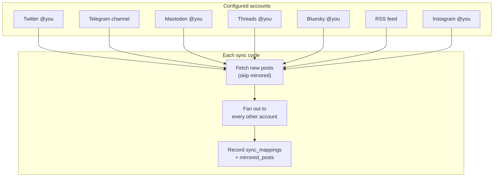

# be-everywhere-bot

A small Python app that **mesh-syncs** your posts across **X (Twitter)**, **Threads**, **Bluesky**, **Telegram**, **Mastodon**, **Instagram**, and **RSS feeds**. When a new post appears on any connected account, it is reposted to every other account. The bot tracks what was already synced so nothing is duplicated — including posts it created itself (so a Twitter thread reposted to Telegram is never echoed back to Twitter).

## Features

- **Mesh sync** — every configured account syncs to every other account
- **Multiple accounts per network** — connect several Twitter/Telegram/Mastodon accounts with `--label`
- **Thread support** — consecutive posts in the same conversation are merged when the destination allows
- **Duplicate protection** — `sync_mappings` + `mirrored_posts` prevent re-syncing and circular reposts
- **Smart filtering** (X) — skips retweets, quote tweets, `@`-replies, and replies to other people
- **Link unwrapping** — `t.co` and other shorteners are resolved before posting
- **Two run modes** — continuous watch (cron schedule) and one-shot backfill (`--since`)
- **Database migrations** — schema upgrades run automatically on startup

## Requirements

- **Python 3.13+**
- **[uv](https://docs.astral.sh/uv/)** (recommended)
- API credentials for each network you want to connect

## Quick start

```bash
git clone <repo-url> be-everywhere-bot
cd be-everywhere-bot
uv sync

# Configure accounts (repeat with different --label for multiple accounts)
uv run python main.py --auth=twitter
uv run python main.py --auth=telegram
uv run python main.py --auth=mastodon
uv run python main.py --auth=threads
uv run python main.py --auth=bluesky
uv run python main.py --auth=rss
uv run python main.py --auth=instagram

# Run continuous mesh sync
uv run python main.py
```

## Setup

### Connect accounts

```bash
uv run python main.py --auth=twitter --label=personal
uv run python main.py --auth=twitter --label=work
uv run python main.py --auth=telegram --label=main
uv run python main.py --auth=mastodon --label=fedi
uv run python main.py --auth=threads --label=main
uv run python main.py --auth=bluesky --label=main
uv run python main.py --auth=rss --label=blog
uv run python main.py --auth=instagram --label=main
```

Re-running `--auth` with the same network + label updates credentials.

### X (Twitter)

Bearer token from [developer.x.com](https://developer.x.com/en/portal/dashboard) and your `@handle`.

### Telegram

Bot token from [@BotFather](https://t.me/BotFather) and channel ID (`@channel` or `-100…`). The bot must be a channel admin. New channel posts are received via `getUpdates` — the Bot API cannot backfill full channel history.

### Mastodon

Instance URL and access token (Preferences → Development → your app). Needs `read` + `write` scopes.

### Threads

Access token from [developers.facebook.com](https://developers.facebook.com/apps/) with scopes `threads_basic` and `threads_content_publish`. Username is auto-detected from the token.

**Note:** Threads API requires media to be on a **public HTTPS URL** when publishing images/videos. Posts synced from X/Mastodon usually work; Telegram-sourced media may publish as text-only.

### Bluesky

Handle and **app password** from Bluesky Settings → Privacy and security → App passwords (not your login password). Supports direct blob upload for images and videos.

### RSS (one-way)

Feed URL for any RSS 2.0 or Atom feed. Each item is published as **title**, **description/summary**, and a **link** to the original post.

```bash
uv run python main.py --auth=rss --label=blog
# prompts for https://example.com/feed.xml
```

Use `--since=YYYY-MM-DD` to import older feed items on first run.

### Instagram (one-way)

Instagram Business or Creator account as a **read-only source**. Feed posts are republished with their caption; active **stories** (24 h window) are synced too. Story slides posted within `POST_MIN_AGE_MINUTES` of each other are merged into one multi-media post on destinations that support it (Telegram, Mastodon, etc.).

Access token from [developers.facebook.com](https://developers.facebook.com/apps/) with scope `instagram_business_basic`. Username is auto-detected from the token.

```bash
uv run python main.py --auth=instagram --label=main
```

Instagram is never used as a destination — content flows out, not in.

## Running

```bash
uv run python main.py                      # watch mode (default)
uv run python main.py --since=2026-01-01   # backfill from date
uv run python main.py --list-accounts      # show configured accounts
uv run python main.py -v                   # debug logging
```

### Watch mode

Polls on a **cron schedule** (see `WATCH_CRON` in `config.py`). For each account:

1. Fetches recent posts (skipping mirrored/sync-created posts)
2. Skips posts younger than **30 minutes** (editable window on source networks)
3. Publishes unsynced content to every other account
4. Records mappings so the same content is never reposted again

### Backfill (`--since`)

One-shot sync since the given date. Skips min-age filter, adds a **3 second delay** between publishes. Works for X and Mastodon history; Telegram only picks up posts received via `getUpdates` since the bot was configured.

### Docker

```bash
docker compose run --rm bot uv run python main.py --auth=twitter
docker compose run --rm bot uv run python main.py --auth=telegram
docker compose run --rm bot uv run python main.py --auth=mastodon
docker compose run --rm bot uv run python main.py --auth=threads
docker compose run --rm bot uv run python main.py --auth=bluesky
docker compose run --rm bot uv run python main.py --auth=rss
docker compose run --rm bot uv run python main.py --auth=instagram
docker compose up -d
```

## How it works



### Duplicate prevention

Two tables work together:

| Table | Purpose |
|-------|---------|
| `sync_mappings` | `(source_account, source_post) → dest_account` — "already propagated" |
| `mirrored_posts` | `post_id` on an account that was **created by sync** — skipped on fetch |

When a Twitter thread `[A, B, C]` is merged into one Telegram message `X`:

- Three mapping rows: `A→X`, `B→X`, `C→X` (same dest post id)
- One mirrored row: Telegram post `X`
- Next run: Twitter posts are skipped for Telegram; Telegram post `X` is never fetched as new content

### Project structure

```
be-everywhere-bot/
├── main.py                 # CLI: watch / --since / --auth / --list-accounts
├── config.py               # Timing, network limits, paths
├── apis/                   # One module per network (fetch + publish + auth)
├── db/
│   ├── accounts.py         # Multi-account credentials
│   ├── sync_state.py       # Mappings, mirrored posts, sync watermarks
│   └── migrations/         # Schema migrations (auto-applied)
└── sync/
    ├── engine.py           # Mesh sync orchestration
    └── thread_processor.py # Thread merging, text splitting
```

## Configuration

| Constant | Default | Description |
|----------|---------|-------------|
| `POST_MIN_AGE_MINUTES` | `30` | Min post age before publishing (watch mode) |
| `WATCH_CRON` | `0,30 9-23 * * *` | Watch-mode cron schedule (UTC) |
| `BACKFILL_POST_DELAY_SECONDS` | `3` | Delay between posts in `--since` mode |
| `WATCH_MAX_PAGES` | `2` | Max X API pages per poll |
| `WATCH_OVERLAP_HOURS` | `6` | Re-fetch overlap for threads / retries |

## Database migrations

**You don't need a separate migrate step.** Every command that touches the database (`main.py` watch mode, `--auth`, `--since`, `--list-accounts`, etc.) calls `get_engine()`, which:

1. Creates any missing tables
2. Runs pending migrations from `db/migrations/versions/`
3. Records applied versions in `schema_migrations`

### Upgrading an existing install

Pull the new code, rebuild Docker if you use it, then start as usual:

```bash
# Local
uv sync
uv run python main.py          # migrates, then watch mode

# Docker
docker compose build
docker compose up -d           # migrates on container start
```

Migration `001_mesh_accounts` converts the old `credentials` / `posted` / `sync_state` tables to the new multi-account schema. Your data in `./data/be_everywhere.db` is preserved via the Docker volume.

### Migrate only (no sync)

```bash
uv run python main.py --migrate

docker compose run --rm bot uv run python main.py --migrate
```

Use `-v` to see `Applying migration …` log lines.

## Database

SQLite at `data/be_everywhere.db` (auto-created, migrated on startup):

| Table | Purpose |
|-------|---------|
| `accounts` | Connected accounts (`network` + `label`) |
| `account_credentials` | Tokens and settings per account |
| `sync_mappings` | Propagation tracking (prevents re-sync) |
| `mirrored_posts` | Sync-created posts (prevents circular repost) |
| `account_sync_state` | Last fetch watermark per account |
| `schema_migrations` | Applied migration versions |

Legacy single-account schema is migrated automatically by `001_mesh_accounts`.

## Troubleshooting

| Problem | Fix |
|---------|-----|
| No accounts configured | Run `--auth=…` for each network |
| Post not synced yet | May be younger than 30 min in watch mode |
| Telegram history missing | Bot API can't backfill channels; use `--since` on X/Mastodon |
| Instagram stories missing | Stories expire after 24 h; run watch mode regularly |
| Circular repost | Should not happen — check `mirrored_posts` is populated |
| HTTP 402 on X | Top up API credits at developer.x.com |

```bash
uv run python main.py -v   # debug logging
```

## License

Private / personal use. Adjust as needed.
