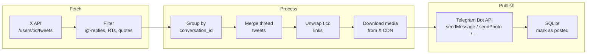

# be-everywhere-bot

A small Python app that syncs your posts from **X (Twitter)** to **Telegram**. It polls your own timeline, filters out noise (replies, retweets, quotes), combines threads into readable messages, re-uploads media, and tracks what was already posted so nothing is duplicated.

Designed to be extended: more source and destination networks can be added later without rewriting the core.

## Features

- **X → Telegram sync** — text, photos, videos, and GIFs
- **Thread support** — consecutive tweets in the same conversation are merged into one or more Telegram messages, in order
- **Smart filtering** — skips retweets, quote tweets, `@`-replies, and replies to other people
- **Link unwrapping** — `t.co` and other shorteners are resolved to the real URL before posting
- **Duplicate protection** — SQLite tracks every successfully synced tweet per destination
- **Two run modes** — continuous watch (poll every 20 min) and one-shot backfill (`--since`)
- **Credit-conscious** — watch mode only reads recent own tweets from the X API, not your full history every poll

## Requirements

- **Python 3.13+**
- **[uv](https://docs.astral.sh/uv/)** (recommended) or pip
- An **X Developer account** with API credits ([developer.x.com](https://developer.x.com/en/portal/dashboard))
- A **Telegram bot** ([@BotFather](https://t.me/BotFather)) with permission to post to your channel

## Quick start

```bash
git clone <repo-url> be-everywhere-bot
cd be-everywhere-bot
uv sync

# Configure credentials (interactive prompts, stored in SQLite)
uv run python main.py --auth=twitter
uv run python main.py --auth=telegram

# Run continuous sync
uv run python main.py
```

## Setup

### 1. Install dependencies

```bash
uv sync
```

Dependencies: `httpx` (HTTP client), `sqlalchemy` (SQLite). No `.env` file is required — all account secrets go into the local database.

### 2. Configure X (Twitter)

```bash
uv run python main.py --auth=twitter
```

You will be prompted for:

| Field | Where to get it |
|-------|-----------------|
| **Bearer Token** | [developer.x.com](https://developer.x.com/en/portal/dashboard) → your Project → App → **Keys and tokens** → **Bearer Token** → Generate |
| **Username** | Your `@handle` without the `@` (e.g. `vas3k`) |

The app validates the token, looks up your numeric user ID, and stores everything in `data/be_everywhere.db`.

**X API billing:** reading your own timeline is an *owned read* (~$0.001 per tweet on pay-per-use). Watch mode is tuned to minimize reads. If credits run out you will see HTTP 402 — top up at the developer portal.

### 3. Configure Telegram

```bash
uv run python main.py --auth=telegram
```

You will be prompted for:

| Field | Where to get it |
|-------|-----------------|
| **Bot token** | [@BotFather](https://t.me/BotFather) → `/newbot` or use an existing bot |
| **Channel ID** | `@yourchannel` or numeric ID like `-1001234567890` |

The bot must be an **admin** of the channel with permission to post messages.

To find a numeric channel ID: forward a channel post to [@userinfobot](https://t.me/userinfobot) or use the Telegram API.

## Running

```bash
uv run python main.py                 # watch mode (default)
uv run python main.py --since=2026-01-01   # backfill from date
uv run python main.py -v              # verbose / debug logging
uv run python main.py --help          # full CLI help + auth instructions
```

### Watch mode (default)

Polls every **20 minutes**. For each cycle:

1. Fetches your recent own tweets (see [API cost controls](#x-api-cost-controls))
2. Skips tweets younger than **30 minutes** (so you can still edit or delete on X)
3. Publishes anything not yet in the database
4. Sleeps until the next cycle

Run this as a long-lived process (terminal, `tmux`, `systemd`, etc.).

### Backfill mode (`--since`)

One-shot sync of all eligible tweets since the given date (UTC midnight):

```bash
uv run python main.py --since=2026-01-01
uv run python main.py --since=2026-06-01T12:00:00   # optional time
```

- Skips the 30-minute min-age filter (posts immediately)
- Adds a **3 second delay** between posts to avoid Telegram rate limits
- Paginates through your full timeline back to the date — use this for initial import, not watch mode

### Re-authenticate

Credentials can be updated at any time by running `--auth=twitter` or `--auth=telegram` again.

### Docker

```bash
# One-time auth (interactive prompts; writes to ./data/)
docker compose run --rm bot uv run python main.py --auth=twitter
docker compose run --rm bot uv run python main.py --auth=telegram

# Run watch mode in the background
docker compose up -d

# Logs
docker compose logs -f

# One-off backfill
docker compose run --rm bot uv run python main.py --since=2026-01-01

# Stop
docker compose down
```

The `./data` directory is mounted as a volume so credentials and sync state survive container restarts.

## How it works



### Sync pipeline

1. **Fetch** — `apis/twitter.py` calls `GET /2/users/{id}/tweets` for your own account only. No third-party timelines or search endpoints.
2. **Filter** — drops retweets, quotes, tweets starting with `@`, and replies to other users. Keeps standalone tweets and self-thread continuations.
3. **Group** — tweets with the same `conversation_id` are treated as one thread.
4. **Batch** — within each thread, unposted tweets are collected in chronological order. In watch mode, stops at the first tweet that is not yet old enough.
5. **Transform** — thread text is joined with blank lines. Long text is split at paragraph/sentence boundaries to fit Telegram limits. Media is chunked into albums of up to 4 items.
6. **Publish** — media is downloaded from X, `t.co` links in text are unwrapped, and messages are sent via the Telegram bot API (with automatic retry on HTTP 429).
7. **Track** — each tweet ID is recorded in SQLite **only after** a successful publish. Failed posts stay unmarked and will be retried on the next cycle.

### What gets synced

| Included | Excluded |
|----------|----------|
| Original tweets | Retweets |
| Self-thread replies (e.g. `2/ …`) | Tweets starting with `@` |
| Photos, videos, GIFs | Quote tweets |
| Links in tweet text (unwrapped) | Replies to other people |

Trailing X media/status links appended by Twitter are stripped. User-shared `t.co` links in text-only tweets are kept and unwrapped at publish time.

## Project structure

```
be-everywhere-bot/
├── main.py                 # CLI entry point: watch / --since / --auth
├── config.py               # Timing, paths, network pairs, API settings
│
├── apis/                   # One module per social network (same function interface)
│   ├── types.py            # Post, MediaItem, OutboundPost dataclasses
│   ├── twitter.py          # X auth, fetch_posts, download_media
│   ├── telegram.py         # Telegram auth, publish_outbound
│   └── urls.py             # Short-link unwrapping (t.co, bit.ly, …)
│
├── db/
│   ├── schema.py           # SQLAlchemy table definitions
│   ├── connection.py       # SQLite engine + auto-create tables
│   ├── credentials.py      # Store/read network tokens
│   └── posts.py            # Posted-tweet tracking, sync state
│
├── sync/
│   ├── engine.py           # Orchestrates fetch → group → publish → mark
│   └── thread_processor.py # Thread merging, text splitting, media chunking
│
├── data/                   # Created at runtime (gitignored)
│   └── be_everywhere.db    # Credentials + posted tweets + sync timestamps
│
├── pyproject.toml
└── uv.lock
```

### Key modules

| Module | Role |
|--------|------|
| `main.py` | Parses CLI args, runs watch loop or one-shot backfill |
| `config.py` | All tunable constants — edit here, not scattered in code |
| `sync/engine.py` | Core sync logic; maps source→destination pairs from `SYNC_PAIRS` |
| `apis/twitter.py` | X API v2 client (Bearer token auth, timeline pagination) |
| `apis/telegram.py` | Telegram Bot API client with rate-limit retry |
| `db/posts.py` | `is_posted()`, `mark_posted()`, `get_last_synced_at()` |

Each network module exposes the same async functions (no classes): `authenticate`, `fetch_posts`, `publish_post` / `publish_outbound`, `download_media`. New networks plug in by implementing these and registering handlers in `sync/engine.py`.

## Configuration

All settings live in `config.py`:

| Constant | Default | Description |
|----------|---------|-------------|
| `WATCH_INTERVAL_MINUTES` | `20` | How often watch mode polls X |
| `TWEET_MIN_AGE_MINUTES` | `30` | Minimum tweet age before posting (watch mode) |
| `BACKFILL_POST_DELAY_SECONDS` | `3` | Pause between posts during `--since` backfill |
| `WATCH_MAX_PAGES` | `2` | Max X API pages per watch poll (~200 tweets) |
| `WATCH_OVERLAP_HOURS` | `6` | Re-fetch window for threads and retries |
| `WATCH_INITIAL_LOOKBACK_HOURS` | `48` | First watch run: how far back to look |

Network routing:

```python
SYNC_PAIRS = [
    ("twitter", "telegram"),   # source → destination
]
```

Add more pairs here when new networks are implemented.

## Database

Everything is stored in `data/be_everywhere.db` (SQLite, created automatically):

| Table | Purpose |
|-------|---------|
| `credentials` | Bearer token, user ID, username, bot token, channel ID |
| `posted` | `(source_network, source_post_id, destination_network)` — one row per successfully synced tweet |
| `sync_state` | Last sync timestamp per source→destination pair |

The database file is gitignored. Back it up if you migrate machines.

**Reset sync state** (re-post everything): delete `data/be_everywhere.db` and re-run `--auth`. There is no `--force` flag — duplicates are prevented by the `posted` table.

## X API cost controls

Watch mode is optimized for app creators reading **only their own tweets**:

- Uses `GET /users/{your_id}/tweets` — owned reads, not third-party lookups
- Passes `start_time` so the API does not return ancient history
- Caps pagination at `WATCH_MAX_PAGES` (2 pages ≈ 200 raw tweets per poll)
- On first run, looks back only `WATCH_INITIAL_LOOKBACK_HOURS` (48h) — use `--since` for historical import

Typical watch poll: **1–2 API calls**, reading a handful to a few dozen tweets. Backfill cost scales with how many tweets exist since the given date.

## Troubleshooting

| Problem | Fix |
|---------|-----|
| `X not configured` | Run `uv run python main.py --auth=twitter` |
| `Telegram not configured` | Run `uv run python main.py --auth=telegram` |
| HTTP 402 CreditsDepleted | Top up X API credits at [developer.x.com](https://developer.x.com/en/portal/dashboard) |
| Tweet not posted yet | It may be younger than 30 min (watch mode). Wait or use `--since` backfill |
| Thread posted incomplete | Wait for all parts to pass min-age, or run backfill |
| Telegram 429 rate limit | Automatic retry with backoff; backfill already has 3s delay between posts |
| Missing old tweets in watch mode | Watch only covers recent window. Run `--since=YYYY-MM-DD` for history |

Enable debug logging to see filter and pagination details:

```bash
uv run python main.py -v
```

## License

Private / personal use. Adjust as needed.
